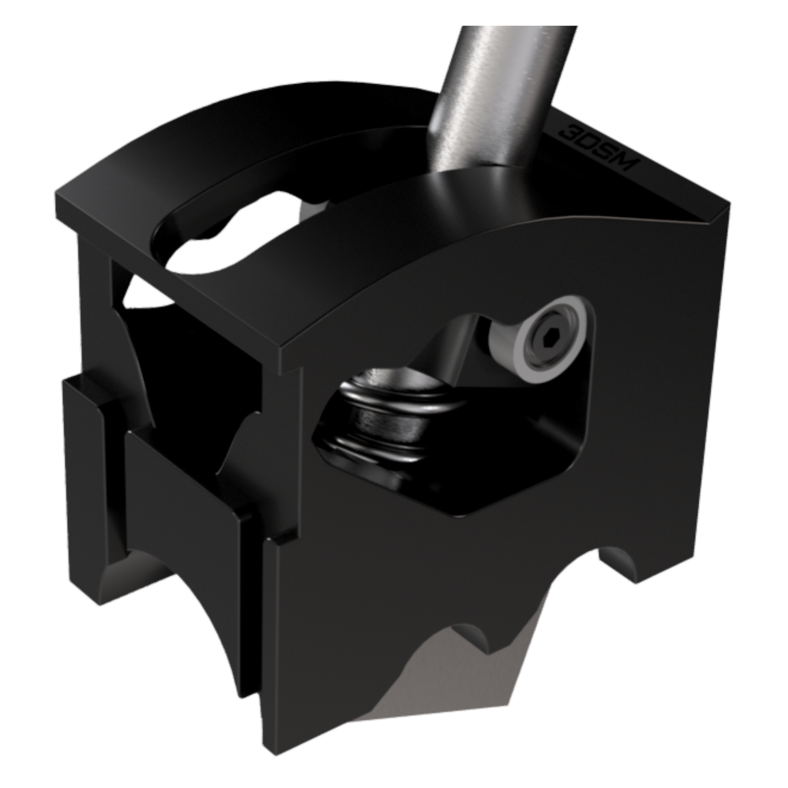

## About the Mod:
This mod makes the TH8A shifting experience far more realistic.
 

### Installation guide:
#### Tools recquired:
- 2.5 mm Allen key
- Screwdriver
- Gloves (recommended to protect against sharp internal edges)
- Cutting pliers
 

##### 1. Unscrew the lever.
 

##### 2. Unscrew the three screws securing the mounting clamp.

##### 3. Remove the gate.
 

##### 4. Unscrew the plastic gate, taking care not to damage the cable connected to the sequential mode detection switch.
 

##### 5. Cut the zip tie to free the cable.
 

##### 6. Install the Axial Force Mod into the lever.

##### 7. Reinstall the plastic gate in the correct orientation. You can use the button as a reference point (see picture).
 

##### 8. Unscrew the nine screws from the housing.
 

##### 9. Pass the supplied zip ties around the shaft on which the mod sits and through the grooves in the mod.
 

##### 10. Tighten the zip ties, then cut off the excess length.

##### 11. Reassemble the shifter housing (cover, gate, lever, and mounting clamp). The installation is complete.
 
